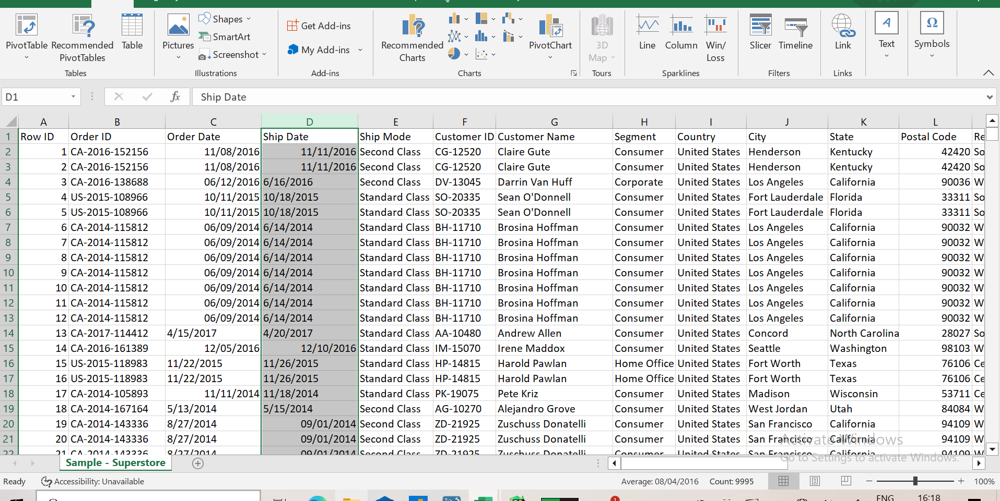
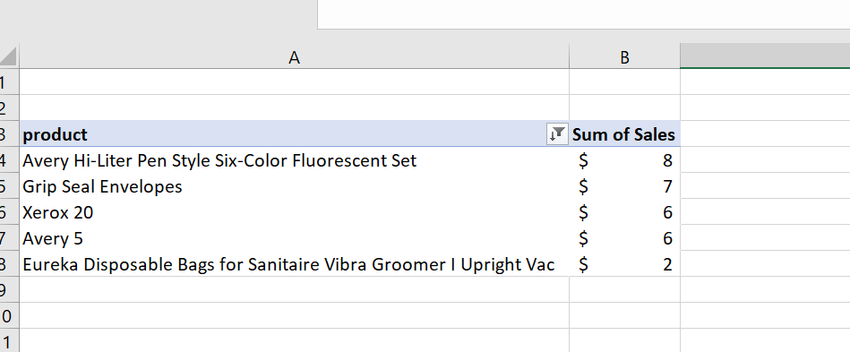
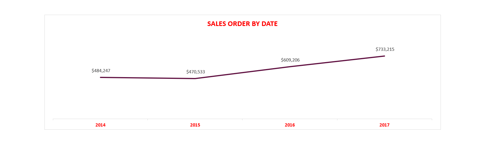

# EXCEL-PROJECT
 I participated in this project, where i was given a huge and dirty dataset with over 9000 rows and asked to conduct an analysis. so here is the Project details

 

 ---

### About The Dataset

---

### Steps
1. ##### Cleaning
 the dataset was imported into Microsoft Excel for cleaning, so the order date and ship date column was not well placed, some of the dates are in text format(which 
 is normally assigned to left). i started by inserting a new worksheet then used 'text to column' to create a new column and set it to the proper format, then i also 
 checked for duplicate rows or cells in the table.Before proceeding to turning it into a table.
     

 I cleaned and turned it into a proper table

   

2. ##### Derived And Asked Questions
  From the project details,i was asked to come up with six business questions i intend to answer with the data, i was able to come up with more than 6 questions but 
  for the sake of the project i projected only these six
    * what is the total and average sales recorded from the data (2014-2017).
    * which products have the least and highest sales.
    * what is the total profit and sales generated and which region had the highest and lowest,and at what percentage.
    * what year and quarter was the highest order and sales recorded.
    * what are the sales percentage by category
    * who are the best customers that brought more sales and profit,because they need to be encouraged.

3. ##### Data Analysis/ Pivot/ Visualization
      The first question i used the sum fuction to sum up the range of the total sale which is =sum(r2:r9995) to get, which me  $2,297,201 

 and an average function (=average(r2:r9995)) that gave me the average sale of $230 between the four years that was recorded on the data set

---

      The second question i used the pivot table to calculate them, 'Canon imagec classs 2200 advanced copier'had the highest sale of $61,600
which is twice of the second product (Fellowes pb500 punch comb with manual bind) with the sales of $27,453. i filtered the products to the best five products and the product with the least number of sales because the products are much.

this is the least of the best 5 or top 5 product
 

---
and this is the least of the bottom 5 products withe the worst sales
  

---

 The third question, i also used the sum function to calculate the the whole profit and the whole sales,using the pivot table i was able check the regions and also the total sales generated by each of the four regions and was also able to tell the region that recorded the highest or lowest sales and profit. the also created a visual to give more insight on how the regions performed. 

  using the sum function, Total sales generated is =sum(s2:s9995) $2,297,201. $725,458 (at32%) from the WEST, $391,772 (at 17%) from the SOUTH, $678,781 (30%)from the EAST, and $501,240 from CENTRAL (22%). also the average by region using the sum function =sum(r2:r9995) which is $574,300
  
 

 then here is the visual i created for REGION BY PROFIT. the WEST generated the most profit with $108,418, EAST $91,523, SOUTH $46,749, CENTRAL generated the least profit of $39,706
 

 ---
    
  The fourth question, i created a pivot table and a chart to show the order date and sales date.

 
the fourth quater in the year 2017 recorded the highest order and sales.

---

The fifth question was also visualized for more insight, the technology category contributed 37% which the highest, 32% for furniture category, and 31% for office supplies which is the least generated.

---

i also added a suitable slicer connected to the three charts i created. using the segment

The sixt, which is the last question i used the pivot table to identify and filter the top performing customers so they can be appreciated more. And of course also see the customers that are not investing more due to one reason or the other,we would also organize and recommend a meeting for them so we know to move forward as a company.
these are the top ten customers with sean miller toping the list.

and these are the under performing customers that need to be focused on

---

here are also the other pivot tables and some key information i created in analyzing the dataset

  

so, finally focus attention needs to be placed on the underperforming customers so as to help figure out how they can improve in their patronage. and also the best customers because they need to be encouraged and motivated. And also through this analysis, we can tell the year and quarter the most sales and profit was generated.i hope my analysis will help to perform better and make informed decisions in the coming year.

  
  

    
    
    

